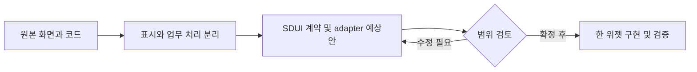

# language-study-log — SDUI 위젯 후보

목표: 원래 화면의 역할과 코드를 확인하고, 한 위젯씩 분리할 대상을 정한다. 기준: `main` / `e69a55b2d0ecab5e1458a428382b22a342c68ac9`.

학습 달력·하루 일정·미완료 복구·복습카드 기능이 실제 React 컴포넌트로 분리되어 있다. 읽기용 UI는 추출하기 좋고 저장/복습 알고리즘은 학습 전용으로 유지한다.

공개 범위: 공개. GitHub licenseInfo 없음: 재배포 권한 별도 확인. 후보는 구현 완료나 재배포 허가를 의미하지 않는다.

9/18·19·20 KST 커밋 수: 3 / 4 / 2. 병합·문서 커밋 포함; 기능 수 아님. 일요일은 조사 시점까지만.

|ID|위젯 후보|현재 상태|분리 작업|
|---|---|---|---|
|R15-W01|학습 주·월 달력|기존 독립 컴포넌트 · 우선 후보|날짜·집계 DTO를 calendar 공통형으로 변환; 날짜/보기 event 계약 정의|
|R15-W02|하루 학습량·일정 카드|기존 독립 컴포넌트 · 우선 후보|list-item, duration-summary, allowedActions schema로 추출. 학습완료/복습행동은 도메인 adapter|
|R15-W03|미완료 항목 재계획 큐|기존 UI/API 있음 · 공통틀 후보|검색/선택/페이지/부분실패 UI 공통화; reschedule/archive/restore 상태전이는 도메인별 유지|
|R15-W04|복습카드 세션·평가|기존 로직 있음 · 학습 전용 유지|카드 뒤집기 표시 UI만 quiz와 공유 제안. 복습계산/평가값/저장 adapter 유지|

## R15-W01 · 학습 주·월 달력

날짜별 완료율·공부시간·복습 수를 표시하고 날짜 선택을 부모에 알린다.

|항목|내용|
|---|---|
|입력|date,today,view,days,loading,onDate,onView|
|처리|calendarDays로 날짜칸 생성; count 대비 completed 비율을 계산|
|반환·화면|주/월 달력 React 화면; date/view callback|
|API|컴포넌트 직접 API 없음; StudySchedule→GET /api/dashboard/schedule|
|저장|컴포넌트 저장 없음; 데이터 원천 study_plans/review_sessions 등|
|부수효과|날짜선택 callback만. 상위 조회는 schema ensure가 있어 완전 무쓰기 단정 금지|
|보안·분리 경계|읽기 달력 UI 공통화 가능. 개인 일정 데이터/권한과 학습 데이터 모델은 따로|
|공통화 계열|calendar-agenda|
|구현 후 통과 기준|월/주 전환·0건·날짜이동·loading 시 완료율 표시. 개인달력과 학습 규칙 병합하지 않음|

핵심 코드:
- [StudyCalendar · app/components/StudyCalendar.tsx:3](https://github.com/feed-mina/language-study-log/blob/e69a55b2d0ecab5e1458a428382b22a342c68ac9/app/components/StudyCalendar.tsx#L3)
- [scheduleGet · app/components/StudySchedule.tsx:25](https://github.com/feed-mina/language-study-log/blob/e69a55b2d0ecab5e1458a428382b22a342c68ac9/app/components/StudySchedule.tsx#L25)
- [readSchedule · worker/study-schedule.ts:32](https://github.com/feed-mina/language-study-log/blob/e69a55b2d0ecab5e1458a428382b22a342c68ac9/worker/study-schedule.ts#L32)

## R15-W02 · 하루 학습량·일정 카드

선택한 하루의 학습·복습 목록과 배정시간/목표시간 차이를 보여준다.

|항목|내용|
|---|---|
|입력|date,items,budget,canEdit,busy 및 행동 callbacks|
|처리|items.minutes 합계와 budget 비교; 유형/완료상태에 맞는 버튼 표시|
|반환·화면|일정 카드와 여유/초과 시간; complete/undo/edit/review 이벤트|
|API|직접 API 없음; 상위 props handler가 저장|
|저장|UI 자체 저장 없음|
|부수효과|클릭 callback에 따라 상위 DB 변경; 읽기모드 canEdit 차단|
|보안·분리 경계|canEdit UI 차단만 믿지 않고 서버 인증 필수. minutes 단위를 다른 프로젝트와 통일|
|공통화 계열|calendar-agenda|
|구현 후 통과 기준|예산초과·시간미정·완료/취소·읽기전용 입력에서 버튼과 합계가 일치|

핵심 코드:
- [DayAgenda · app/components/DayAgenda.tsx:3](https://github.com/feed-mina/language-study-log/blob/e69a55b2d0ecab5e1458a428382b22a342c68ac9/app/components/DayAgenda.tsx#L3)
- [save · app/components/StudySchedule.tsx:28](https://github.com/feed-mina/language-study-log/blob/e69a55b2d0ecab5e1458a428382b22a342c68ac9/app/components/StudySchedule.tsx#L28)
- [POST · app/api/dashboard/schedule/route.ts:31](https://github.com/feed-mina/language-study-log/blob/e69a55b2d0ecab5e1458a428382b22a342c68ac9/app/api/dashboard/schedule/route.ts#L31)

## R15-W03 · 미완료 항목 재계획 큐

놓친 학습을 검색하고 5개씩 확인하여 날짜 재배정·보관·복원한다. 일부 실패는 선택을 남겨 재시도한다.

|항목|내용|
|---|---|
|입력|period,language,search,cursor,selected ids,target date,time|
|처리|검색250ms 지연/Abort; 서버5건 페이지; 순차 변경; 자정초과 사전차단; 실패항목 유지|
|반환·화면|items/summary/totals/nextCursor; 결과 메시지|
|API|GET /api/dashboard/schedule?mode=recovery; POST action=plan|
|저장|study_plans 및 학습 lifecycle/receipt 기록|
|부수효과|사용자 명시 버튼에서 계획 날짜/상태 변경|
|보안·분리 경계|현재 학습 스키마는 owner 전제. 다중 고객용 전환 전 tenant/auth 범위 추가 검토|
|공통화 계열|recovery-queue|
|구현 후 통과 기준|첫5건/다음페이지·검색변경·부분실패·자정초과·인증실패에서 선택/입력 보존|

핵심 코드:
- [RecoveryQueue · app/components/RecoveryQueue.tsx:10](https://github.com/feed-mina/language-study-log/blob/e69a55b2d0ecab5e1458a428382b22a342c68ac9/app/components/RecoveryQueue.tsx#L10)
- [perform · app/components/RecoveryQueue.tsx:29](https://github.com/feed-mina/language-study-log/blob/e69a55b2d0ecab5e1458a428382b22a342c68ac9/app/components/RecoveryQueue.tsx#L29)
- [recoveryPage · worker/study-schedule.ts:13](https://github.com/feed-mina/language-study-log/blob/e69a55b2d0ecab5e1458a428382b22a342c68ac9/worker/study-schedule.ts#L13)

## R15-W04 · 복습카드 세션·평가

배정한 카드의 답을 확인하고 난이도를 평가하여 다음 복습일을 보여준다.

|항목|내용|
|---|---|
|입력|sessionId,cardId,rating,requestId|
|처리|현재세션조회; 오래된 응답 배제; 서버 receipt/버전검사와 복습계산 후 저장|
|반환·화면|카드 목록·평가상태·nextDue|
|API|GET /api/dashboard/schedule?session=...; POST action=rate|
|저장|study_cards,review_logs,review_session_cards,scheduled_review_receipts|
|부수효과|평가시 다음 due/세션완료상태 변경|
|보안·분리 경계|인증된 POST, 요청 크기 제한, requestId 멱등성/동시평가 보존. 범용 투표점수와 합치지 않음|
|공통화 계열|flashcard-review|
|구현 후 통과 기준|동일 requestId 재시도·동시평가충돌·세션닫기 후 이전응답·완료된 세션 재조회 확인|

핵심 코드:
- [openReview · app/components/StudySchedule.tsx:35](https://github.com/feed-mina/language-study-log/blob/e69a55b2d0ecab5e1458a428382b22a342c68ac9/app/components/StudySchedule.tsx#L35)
- [rate · app/components/StudySchedule.tsx:43](https://github.com/feed-mina/language-study-log/blob/e69a55b2d0ecab5e1458a428382b22a342c68ac9/app/components/StudySchedule.tsx#L43)
- [rateSessionCard · worker/study-schedule.ts:105](https://github.com/feed-mina/language-study-log/blob/e69a55b2d0ecab5e1458a428382b22a342c68ac9/worker/study-schedule.ts#L105)
- [schedulePost · app/components/schedule-client.ts:7](https://github.com/feed-mina/language-study-log/blob/e69a55b2d0ecab5e1458a428382b22a342c68ac9/app/components/schedule-client.ts#L7)

## 예상 작업 순서

이번 조사: 정적 소스 확인. 앱 실행·운영 API·실제 고객 화면 동등성은 검증하지 않았다. 위 흐름은 향후 작업 계획이며 현재 앱 호출 흐름이 아니다.

---

## 화면에서 코드를 따라 읽기

화면 동작 → 처리 코드 → 요청·저장 → 반환과 부수효과 → 수정·검증 순서로 읽는다. UI가 없는 후보는 표시 화면을 새로 만드는 제안이다. 이 문서는 기존 조사 SHA를 기준으로 재구성했으며 최신 앱 실행 검증이 아니다.

### R15-W01 · 학습 주·월 달력

날짜별 완료율·공부시간·복습 수를 표시하고 날짜 선택을 부모에 알린다.

**현재 상태:** 기존 독립 컴포넌트 · 우선 후보

|화면·코드 연결|확인 내용|
|---|---|
|화면에 나오는 결과|주/월 달력 React 화면; date/view callback|
|화면이 받는 값|date,today,view,days,loading,onDate,onView|
|담당 로직|calendarDays로 날짜칸 생성; count 대비 completed 비율을 계산|
|요청 창구|컴포넌트 직접 API 없음; StudySchedule→GET /api/dashboard/schedule|
|저장소 경계|컴포넌트 저장 없음; 데이터 원천 study_plans/review_sessions 등|
|반환과 별도인 동작|날짜선택 callback만. 상위 조회는 schema ensure가 있어 완전 무쓰기 단정 금지|

**핵심 파일의 확인 지점**

- [StudyCalendar](https://github.com/feed-mina/language-study-log/blob/e69a55b2d0ecab5e1458a428382b22a342c68ac9/app/components/StudyCalendar.tsx#L3) — `app/components/StudyCalendar.tsx`에서 이 기능의 선언·호출·계약을 확인한다. 코드 링크는 원래 조사 SHA에 고정되어 있다.
- [scheduleGet](https://github.com/feed-mina/language-study-log/blob/e69a55b2d0ecab5e1458a428382b22a342c68ac9/app/components/StudySchedule.tsx#L25) — `app/components/StudySchedule.tsx`에서 이 기능의 선언·호출·계약을 확인한다. 코드 링크는 원래 조사 SHA에 고정되어 있다.
- [readSchedule](https://github.com/feed-mina/language-study-log/blob/e69a55b2d0ecab5e1458a428382b22a342c68ac9/worker/study-schedule.ts#L32) — `worker/study-schedule.ts`에서 이 기능의 선언·호출·계약을 확인한다. 코드 링크는 원래 조사 SHA에 고정되어 있다.

**유지보수 시 변경할 범위:** 날짜·집계 DTO를 calendar 공통형으로 변환; 날짜/보기 event 계약 정의
**보안·공통화 경계:** 읽기 달력 UI 공통화 가능. 개인 일정 데이터/권한과 학습 데이터 모델은 따로
**회귀 확인:** 월/주 전환·0건·날짜이동·loading 시 완료율 표시. 개인달력과 학습 규칙 병합하지 않음

### R15-W02 · 하루 학습량·일정 카드

선택한 하루의 학습·복습 목록과 배정시간/목표시간 차이를 보여준다.

**현재 상태:** 기존 독립 컴포넌트 · 우선 후보

|화면·코드 연결|확인 내용|
|---|---|
|화면에 나오는 결과|일정 카드와 여유/초과 시간; complete/undo/edit/review 이벤트|
|화면이 받는 값|date,items,budget,canEdit,busy 및 행동 callbacks|
|담당 로직|items.minutes 합계와 budget 비교; 유형/완료상태에 맞는 버튼 표시|
|요청 창구|직접 API 없음; 상위 props handler가 저장|
|저장소 경계|UI 자체 저장 없음|
|반환과 별도인 동작|클릭 callback에 따라 상위 DB 변경; 읽기모드 canEdit 차단|

**핵심 파일의 확인 지점**

- [DayAgenda](https://github.com/feed-mina/language-study-log/blob/e69a55b2d0ecab5e1458a428382b22a342c68ac9/app/components/DayAgenda.tsx#L3) — `app/components/DayAgenda.tsx`에서 이 기능의 선언·호출·계약을 확인한다. 코드 링크는 원래 조사 SHA에 고정되어 있다.
- [save](https://github.com/feed-mina/language-study-log/blob/e69a55b2d0ecab5e1458a428382b22a342c68ac9/app/components/StudySchedule.tsx#L28) — `app/components/StudySchedule.tsx`에서 이 기능의 선언·호출·계약을 확인한다. 코드 링크는 원래 조사 SHA에 고정되어 있다.
- [POST](https://github.com/feed-mina/language-study-log/blob/e69a55b2d0ecab5e1458a428382b22a342c68ac9/app/api/dashboard/schedule/route.ts#L31) — `app/api/dashboard/schedule/route.ts`에서 이 기능의 선언·호출·계약을 확인한다. 코드 링크는 원래 조사 SHA에 고정되어 있다.

**유지보수 시 변경할 범위:** list-item, duration-summary, allowedActions schema로 추출. 학습완료/복습행동은 도메인 adapter
**보안·공통화 경계:** canEdit UI 차단만 믿지 않고 서버 인증 필수. minutes 단위를 다른 프로젝트와 통일
**회귀 확인:** 예산초과·시간미정·완료/취소·읽기전용 입력에서 버튼과 합계가 일치

### R15-W03 · 미완료 항목 재계획 큐

놓친 학습을 검색하고 5개씩 확인하여 날짜 재배정·보관·복원한다. 일부 실패는 선택을 남겨 재시도한다.

**현재 상태:** 기존 UI/API 있음 · 공통틀 후보

|화면·코드 연결|확인 내용|
|---|---|
|화면에 나오는 결과|items/summary/totals/nextCursor; 결과 메시지|
|화면이 받는 값|period,language,search,cursor,selected ids,target date,time|
|담당 로직|검색250ms 지연/Abort; 서버5건 페이지; 순차 변경; 자정초과 사전차단; 실패항목 유지|
|요청 창구|GET /api/dashboard/schedule?mode=recovery; POST action=plan|
|저장소 경계|study_plans 및 학습 lifecycle/receipt 기록|
|반환과 별도인 동작|사용자 명시 버튼에서 계획 날짜/상태 변경|

**핵심 파일의 확인 지점**

- [RecoveryQueue](https://github.com/feed-mina/language-study-log/blob/e69a55b2d0ecab5e1458a428382b22a342c68ac9/app/components/RecoveryQueue.tsx#L10) — `app/components/RecoveryQueue.tsx`에서 이 기능의 선언·호출·계약을 확인한다. 코드 링크는 원래 조사 SHA에 고정되어 있다.
- [perform](https://github.com/feed-mina/language-study-log/blob/e69a55b2d0ecab5e1458a428382b22a342c68ac9/app/components/RecoveryQueue.tsx#L29) — `app/components/RecoveryQueue.tsx`에서 이 기능의 선언·호출·계약을 확인한다. 코드 링크는 원래 조사 SHA에 고정되어 있다.
- [recoveryPage](https://github.com/feed-mina/language-study-log/blob/e69a55b2d0ecab5e1458a428382b22a342c68ac9/worker/study-schedule.ts#L13) — `worker/study-schedule.ts`에서 이 기능의 선언·호출·계약을 확인한다. 코드 링크는 원래 조사 SHA에 고정되어 있다.

**유지보수 시 변경할 범위:** 검색/선택/페이지/부분실패 UI 공통화; reschedule/archive/restore 상태전이는 도메인별 유지
**보안·공통화 경계:** 현재 학습 스키마는 owner 전제. 다중 고객용 전환 전 tenant/auth 범위 추가 검토
**회귀 확인:** 첫5건/다음페이지·검색변경·부분실패·자정초과·인증실패에서 선택/입력 보존

### R15-W04 · 복습카드 세션·평가

배정한 카드의 답을 확인하고 난이도를 평가하여 다음 복습일을 보여준다.

**현재 상태:** 기존 로직 있음 · 학습 전용 유지

|화면·코드 연결|확인 내용|
|---|---|
|화면에 나오는 결과|카드 목록·평가상태·nextDue|
|화면이 받는 값|sessionId,cardId,rating,requestId|
|담당 로직|현재세션조회; 오래된 응답 배제; 서버 receipt/버전검사와 복습계산 후 저장|
|요청 창구|GET /api/dashboard/schedule?session=...; POST action=rate|
|저장소 경계|study_cards,review_logs,review_session_cards,scheduled_review_receipts|
|반환과 별도인 동작|평가시 다음 due/세션완료상태 변경|

**핵심 파일의 확인 지점**

- [openReview](https://github.com/feed-mina/language-study-log/blob/e69a55b2d0ecab5e1458a428382b22a342c68ac9/app/components/StudySchedule.tsx#L35) — `app/components/StudySchedule.tsx`에서 이 기능의 선언·호출·계약을 확인한다. 코드 링크는 원래 조사 SHA에 고정되어 있다.
- [rate](https://github.com/feed-mina/language-study-log/blob/e69a55b2d0ecab5e1458a428382b22a342c68ac9/app/components/StudySchedule.tsx#L43) — `app/components/StudySchedule.tsx`에서 이 기능의 선언·호출·계약을 확인한다. 코드 링크는 원래 조사 SHA에 고정되어 있다.
- [rateSessionCard](https://github.com/feed-mina/language-study-log/blob/e69a55b2d0ecab5e1458a428382b22a342c68ac9/worker/study-schedule.ts#L105) — `worker/study-schedule.ts`에서 이 기능의 선언·호출·계약을 확인한다. 코드 링크는 원래 조사 SHA에 고정되어 있다.
- [schedulePost](https://github.com/feed-mina/language-study-log/blob/e69a55b2d0ecab5e1458a428382b22a342c68ac9/app/components/schedule-client.ts#L7) — `app/components/schedule-client.ts`에서 이 기능의 선언·호출·계약을 확인한다. 코드 링크는 원래 조사 SHA에 고정되어 있다.

**유지보수 시 변경할 범위:** 카드 뒤집기 표시 UI만 quiz와 공유 제안. 복습계산/평가값/저장 adapter 유지
**보안·공통화 경계:** 인증된 POST, 요청 크기 제한, requestId 멱등성/동시평가 보존. 범용 투표점수와 합치지 않음
**회귀 확인:** 동일 requestId 재시도·동시평가충돌·세션닫기 후 이전응답·완료된 세션 재조회 확인
