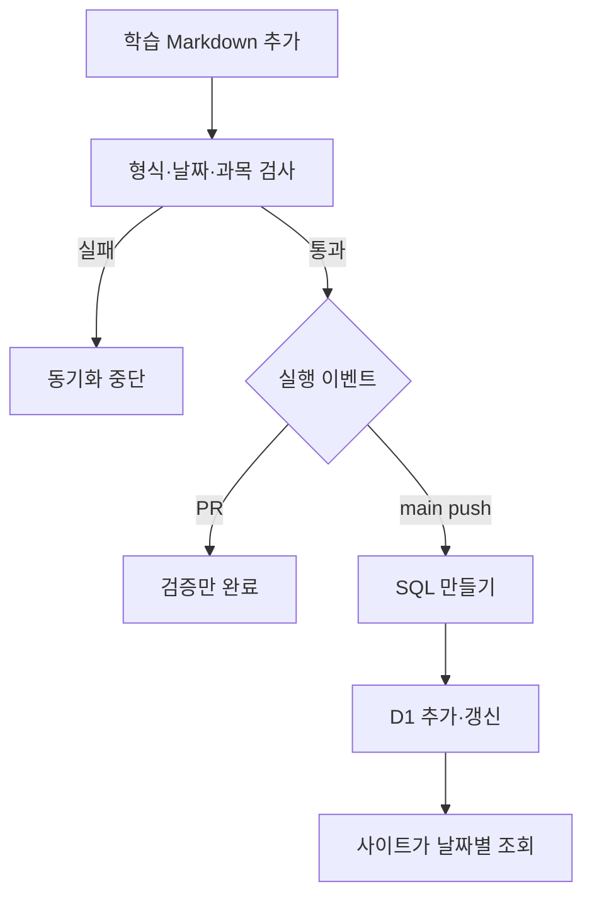

# language-study-log — screen-code-handover 업데이트 인수인계

한국시간 2026년 9월 18~19일 업데이트 보고서. 활동 집계 마감은 9월 19일 21:24:15입니다.

영어·일본어·TOEIC 자료를 날짜별로 보관하고 학습 사이트에 연결하는 저장소입니다. 이번 이틀 동안 각 종류가 하루 한 파일씩, 총 6개 추가됐습니다.

| 항목 | 기준 |
|---|---|
| 보고서 범위 | 이번 기간의 변경과 관련 기능. 전체 시스템 설명은 아래 기존 상세 문서로 연결합니다. |
| 확인 브랜치 | main |
| 소스 기준 | `4cea725e235e` |
| 검증 범위 | 이번에 원본 변환 스크립트로 두 날짜의 파일 6개를 검사해 Validated 6 study log file(s)를 확인했습니다. 해당 커밋 6개 자동 동기화 작업도 모두 success입니다. |
| 보고서 세트 | [쉬운 설명](easy-guide.md) · [수정·검증 지시](fix-guide.md) · [코드 인수인계](screen-code-handover.md) |

## 이번 변경의 경계

- 9월 18일 영어·일본어·TOEIC 자료 3개를 추가했습니다.
- 9월 19일 같은 세 종류 자료 3개를 추가했습니다. 화면 기능 코드 변경은 없습니다.
- 해당 6개 커밋의 Sync ChatGPT study logs 작업이 모두 success로 완료된 기록을 확인했습니다.

이번 업데이트의 핵심은 문서·계약·서버 처리입니다. 실행 화면을 새로 캡처하지 않았으며 확인하지 않은 화면을 실제 실행 결과로 제시하지 않습니다.

## 핵심 파일과 역할

| 핵심 파일 | 함수·컴포넌트 | 담당 역할 |
|---|---|---|
| [scripts/study-log-to-sql.ts](https://github.com/feed-mina/language-study-log/blob/4cea725e235e3c3e7348ab2b929ce61f412ca0ae/scripts/study-log-to-sql.ts) | parseStudyLog / buildStudyLogSql / runCli | 자료 형식을 검사하고 D1 반영용 SQL을 만듭니다. --check는 형식 검증만 합니다. |
| [.github/workflows/sync-study-logs.yml](https://github.com/feed-mina/language-study-log/blob/4cea725e235e3c3e7348ab2b929ce61f412ca0ae/.github/workflows/sync-study-logs.yml) | validate-and-sync | 학습 파일 변경만 골라 검증하고 D1에 반영합니다. PR에서는 실제 동기화를 건너뜁니다. |
| [worker/types.ts](https://github.com/feed-mina/language-study-log/blob/4cea725e235e3c3e7348ab2b929ce61f412ca0ae/worker/types.ts) | isDate / isContentKind / parseStudyPayload | 날짜·과목·본문 구조를 확인하는 공통 규칙입니다. |

## 입력·처리·반환과 부수 효과

| 담당 기능 | 입력 | 처리와 분기 | 반환·출력 | 별도로 일어나는 변경 |
|---|---|---|---|---|
| parseStudyLog | 상대 경로, Markdown 원문 | 경로·머리말·본문 JSON·문항 개수 검사 | ParsedStudyLog | 잘못된 자료는 예외 |
| buildStudyLogSql | 검증된 로그 배열 | 중복 경로·날짜/종류 검사 후 UPSERT SQL 생성 | SQL 문자열 | 이 함수 자체는 운영 DB에 쓰지 않음 |
| --check | 학습 파일 경로 목록 | 파일을 읽어 검사 | Validated N study log file(s). | 파일·DB 쓰기 없음 |

## 동작 흐름

화살표는 호출·데이터 전달 또는 조건 분기를 뜻합니다. 도식에 없는 운영 연결은 확인되지 않았습니다.

## 데이터와 연결 관계

| 저장·전달 대상 | 주요 값 | 관계와 주의점 |
|---|---|---|
| study-logs | YYYY/MM/DD/{english,japanese,toeic}.md | 두 날짜 × 세 종류 = 6개 원본입니다. |
| study_content | content_date,kind,body_json,updated_at | 날짜와 종류가 중복 방지 기준입니다. |
| study_plans | plan_date,category,completed | 자료 생성과 학습 완료를 별개 상태로 관리합니다. |

## 유지보수와 확인 순서

| 바꾸거나 확인할 것 | 확인 위치와 기준 |
|---|---|
| 학습 파일 수정 | 머리말 date/kind와 경로를 맞추고 영어·일본어 5개, TOEIC 10개를 지킵니다. |
| 자동화 변경 | 학습 파일 커밋에 다른 경로를 섞으면 동기화 검사가 거부합니다. |
| 삭제 | 워크플로는 파일 삭제 시 기존 D1 자료를 자동 삭제하지 않습니다. |

저장소 루트에서 `node --experimental-strip-types scripts/study-log-to-sql.ts --check study-logs/2026/09/19/toeic.md`로 파일만 검사할 수 있습니다. 운영 SQL 실행은 이번 보고서 작업에서 하지 않았습니다.

## 검증 결과와 남은 범위

이번에 원본 변환 스크립트로 두 날짜의 파일 6개를 검사해 Validated 6 study log file(s)를 확인했습니다. 해당 커밋 6개 자동 동기화 작업도 모두 success입니다.

실제 사이트의 날짜 선택·정답 클릭·오답 저장과 사용자의 학습 완료 여부는 이번에 확인하지 않았습니다.

## 기존 상세 문서와 활동 근거

- [운영·학습 흐름](https://github.com/feed-mina/language-study-log/blob/4cea725e235e3c3e7348ab2b929ce61f412ca0ae/README.md)
- [9월 19일 TOEIC 동기화 성공](https://github.com/feed-mina/language-study-log/actions/runs/35433674548)

| 한국시간 | 커밋 | 기록된 작업 | 구분 |
|---|---|---|---|
| 09/19 18:03 | [4cea725](https://github.com/feed-mina/language-study-log/commit/4cea725e235e3c3e7348ab2b929ce61f412ca0ae) | docs(study-log): sync toeic 2026-09-19 | 변경 기록 |
| 09/19 08:26 | [a445c0a](https://github.com/feed-mina/language-study-log/commit/a445c0ab66005c7d4d68db8d190d4d3d39e2ff7d) | docs(study-log): sync japanese 2026-09-19 | 변경 기록 |
| 09/19 07:11 | [3b4b710](https://github.com/feed-mina/language-study-log/commit/3b4b7103f198767080a41b788dc8dcb16e6c5e35) | docs(study-log): sync english 2026-09-19 | 변경 기록 |
| 09/18 18:03 | [7e66583](https://github.com/feed-mina/language-study-log/commit/7e665835eafb2127e19b9f0705a45d94347cb734) | docs(study-log): sync toeic 2026-09-18 | 변경 기록 |
| 09/18 08:19 | [73b7277](https://github.com/feed-mina/language-study-log/commit/73b7277424f2852fbb70c10aff6c3dde765ee73d) | docs(study-log): sync japanese 2026-09-18 | 변경 기록 |
| 09/18 07:21 | [b986a00](https://github.com/feed-mina/language-study-log/commit/b986a004470a43040bb5d6e49c2ea3d016e542c3) | docs(study-log): sync english 2026-09-18 | 변경 기록 |
